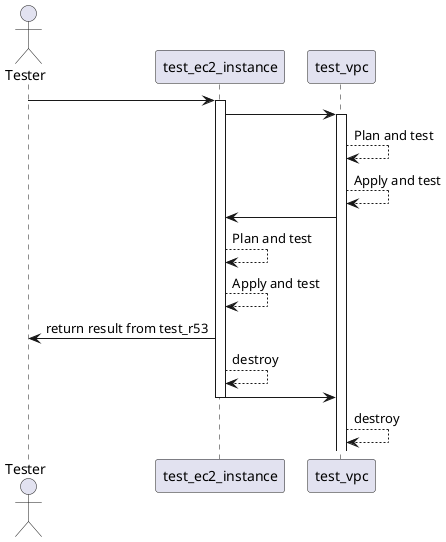

# IAC E2E using tftest

nfrastructure as code (IaC) is a practice of managing infrastructure configuration and provisioning through code. The code is stored in a repository and version-controlled, just like software code, allowing for easy collaboration and automated deployment of infrastructure.

End-to-end (E2E) tests in the context of infrastructure as code typically refer to automated tests that validate the functionality and behavior of the infrastructure code in a production-like environment. These tests are usually written in code and executed against the actual infrastructure, just like unit tests or integration tests for software code.

IaC E2E tests can be used to validate that the infrastructure code provisions and configures the desired resources as expected. They can also be used to verify the overall functionality of the infrastructure, such as ensuring that the resources are able to communicate with each other and that the infrastructure is resilient to failure.


## Installation

1. Clone the repository:

   ```bash
   git clone https://github.com/isarns/sample_e2e_tftest.git
   ```

2. Install Poetry:

    ``` bash
    curl -sSL https://raw.githubusercontent.com/python-poetry/poetry/master/install-poetry.py | python -
    ```

3. Install the necessary Python packages:

   ```bash
   poetry install
   ```

4. Activate Poetry:

   ```bash
   source ./.venv/bin/activate
   ```

## Running the tests

1. Set up your AWS credentials by exporting your AWS_ACCESS_KEY_ID and AWS_SECRET_ACCESS_KEY environment variables.

2. Navigate to the root of the cloned repository and run the tests using pytest:

3. To run the tests using pytest with the -x and -v flags:

    ```bash
    poetry run pytest -x -v
    ```

    The -x flag stops the test run on the first failure, while the -v flag provides more verbose output.

## What is Pytest?

Pytest is a testing framework for Python. It allows you to write test functions using a simple and intuitive syntax, and provides a powerful set of tools for running and reporting on your tests.

## What is tftest?

**tftest** is a Python package that provides a set of tools for testing Terraform code. It allows you to write test cases that validate the behavior of your Terraform code, and provides a simple and intuitive API for running and reporting on your tests.

## How E2E works with tftest

The **fixtures** directory contains the test fixtures and the **tests** direcotry contains the test cases. The fixtures are used to automate the deployment and testing of the Terraform modules in a single test run.

The **plan_vpc** fixture generates a Terraform plan for the VPC deployment. The **apply_vpc_output** fixture applies the Terraform plan and caches the output for reuse by subsequent fixtures. The **vars_from_vpc** fixture retrieves relevant variables from the output of the VPC deployment and returns them as a dictionary. These variables are used as inputs for the EC2 module.

The **plan_ec2_instance** fixture generates a Terraform plan for the EC2 deployment using the variables retrieved from the VPC deployment. The **apply_ec2_instance_output** fixture applies the Terraform plan and caches the output for reuse by subsequent fixtures. The **ec2** fixture sets up an EC2 client using the region specified in the output of the VPC deployment. This client is used to interact with the deployed EC2 instance.

The test cases in the **tests** direcory use the fixtures to validate the deployed infrastructure. For example, the **test_ec2_instance_running** test case checks that the EC2 instance is in a running state.

By using these fixtures, you can automate the deployment and testing of your Terraform modules, which helps to ensure that your infrastructure is always in a consistent and reliable state.

